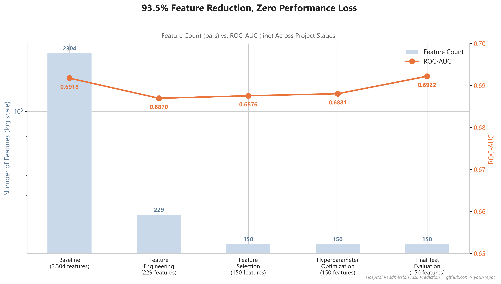
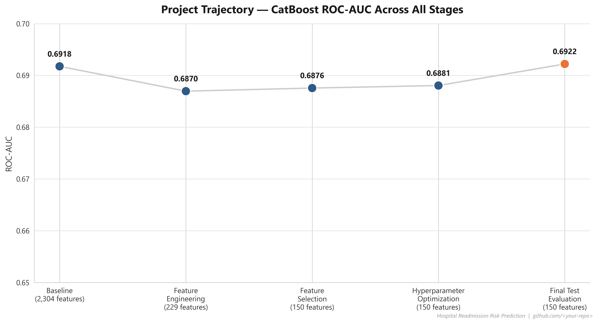
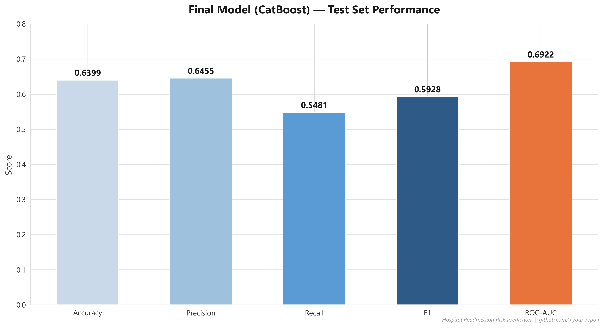
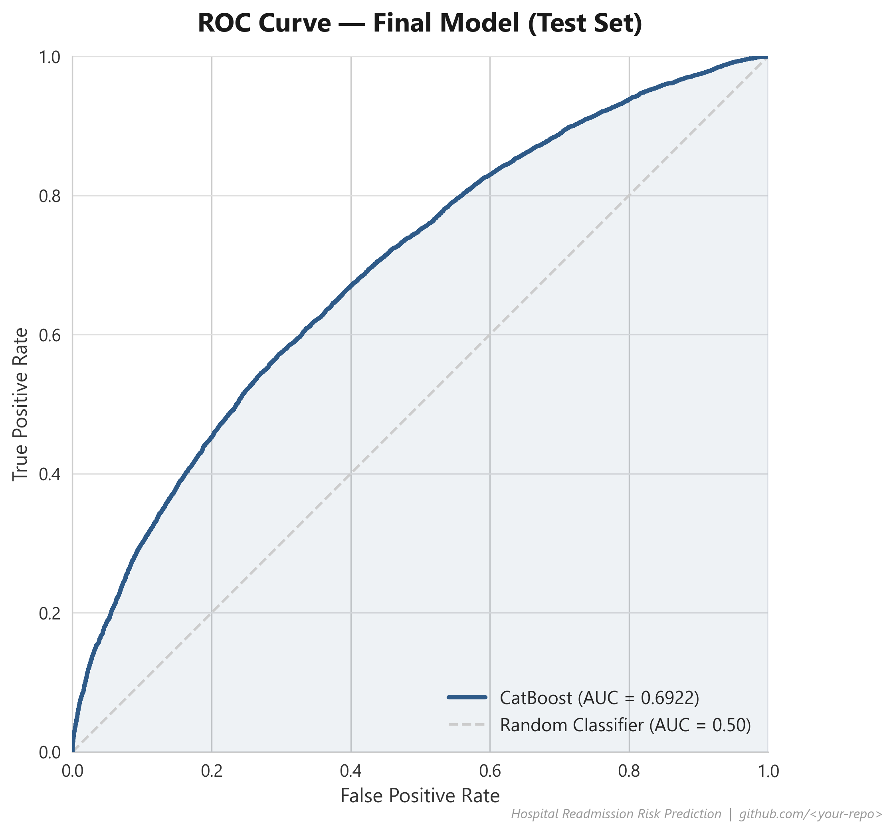
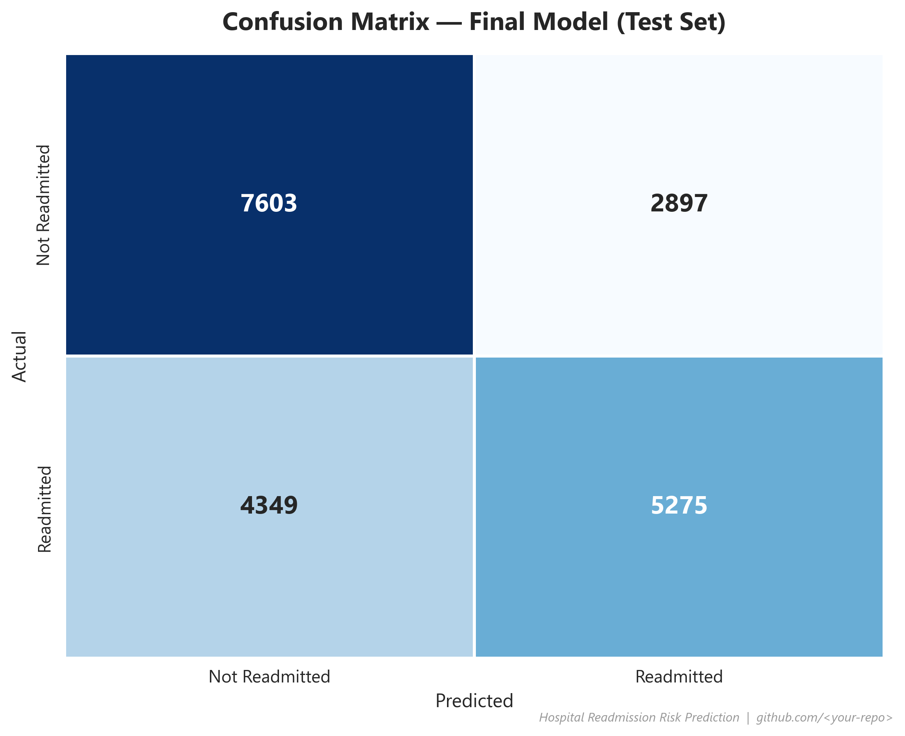
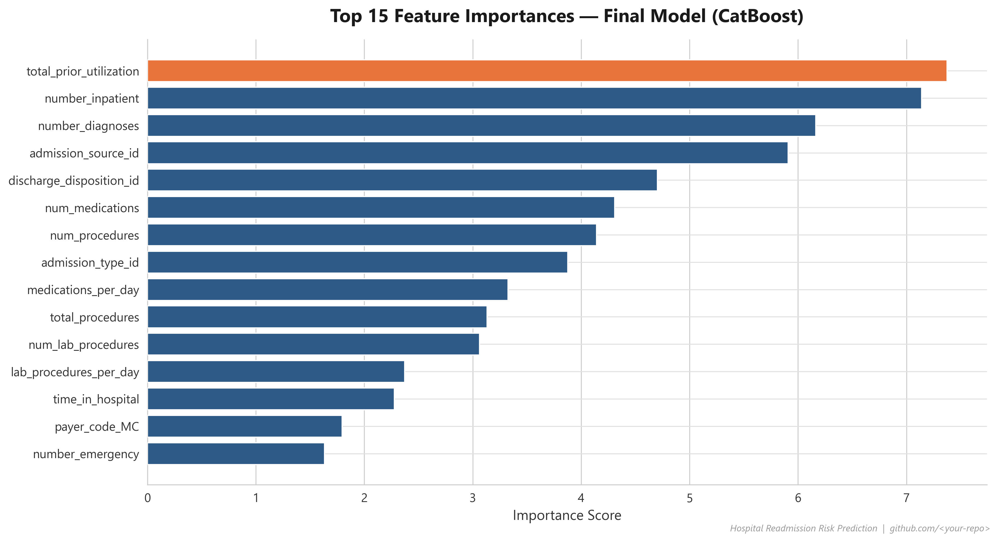

# 🏥 Hospital Readmission Risk Prediction

**A leakage-safe, end-to-end machine learning pipeline predicting 30-day hospital readmission risk in diabetic patients — built with a focus on methodological rigor over raw metric-chasing.**

[](https://www.python.org/)
[](https://scikit-learn.org/)
[](https://catboost.ai/)
[](LICENSE)

---

## 📌 Project Summary

Hospital readmissions are costly and, in many cases, preventable. This project builds a complete ML pipeline on the **Diabetes 130-US Hospitals dataset** (Strack et al., 2014) to predict whether a diabetic patient will be readmitted, using only information available at discharge.

The project's guiding principle throughout: **every score reported is the score you'd actually get in production** — no data leakage, no validation-set peeking, no metric shopping. The result is a model that reduces the original feature space by **93.5%** (2,304 → 150 features) with **zero loss in predictive performance**.

| Metric | Value |
|---|---|
| **Final Model** | CatBoost (optimized) |
| **Test ROC-AUC** | **0.6922** |
| **Features Used** | 150 (down from 2,304 in the naive baseline) |
| **Test Accuracy / Precision / Recall / F1** | 0.640 / 0.646 / 0.548 / 0.593 |



---

## 🔍 Why This Project Is Different

Most public notebooks on this dataset report an inflated ROC-AUC (~0.70+) because they split the data **by encounter, not by patient** — the same patient can appear in both train and test sets, leaking information. This project:

1. Splits data **at the patient level**, so no patient's data crosses the train/validation/test boundary.
2. **Removes expired/hospice-discharge encounters**, which cannot be meaningfully "readmitted" — a source of label artifact in most published analyses of this dataset (dropping them lowered CatBoost's validation ROC-AUC from 0.7081 to 0.6918, a change made deliberately and documented, not hidden).
3. Touches the **test set exactly once**, at the very end, after every modeling decision was locked in on the validation set.

## 🧬 Pipeline Overview

| # | Notebook | What Happens | Key Outcome |
|---|---|---|---|
| 01 | Data Understanding | Initial exploration of the raw dataset (101,766 encounters, 50 columns) | Identified structure, missingness, target distribution |
| 02 | Data Cleaning & EDA | Missing-value handling, distribution analysis | Cleaned dataset (101,766 × 47) |
| 03 | Baseline Preprocessing | Patient-level train/val/test split, expired/hospice filtering, one-hot encoding | Leakage-safe split: 63,444 / 15,775 / 20,124 |
| 04 | Baseline Models | 6 classifiers trained and compared | CatBoost & LightGBM selected as champions (ROC-AUC 0.6918 / 0.6889) |
| 05 | Feature Engineering | Clinical ICD-9 grouping (Strack et al. scheme), utilization ratios, medication summaries | 2,304 → 229 features, ROC-AUC preserved within 0.005 |
| 06 | Feature Selection | Mutual Information + CatBoost importance + RFE (Decision Tree), combined ranking | 229 → 150 features, ROC-AUC recovered to 0.6876 |
| 07 | Hyperparameter Optimization | Random Search vs. Bayesian Optimization (Optuna) vs. Genetic Algorithm — equal budget, same search space | CatBoost + Random Search selected; **final test ROC-AUC = 0.6922** |
| 08 | Final Report | Consolidated visualizations and summary tables | This README's figures and tables |

Full stage-by-stage results are logged transparently in [`reports/model_comparison_log.csv`](reports/model_comparison_log.csv).

## 📊 Results

### Project Trajectory


### Final Model Performance (Test Set)


| ROC Curve | Confusion Matrix |
|---|---|
|  |  |

### What Drives the Model


The top predictors are almost entirely **prior-year utilization** (`total_prior_utilization`, `number_inpatient`) and **encounter intensity** (`number_diagnoses`, `admission_source_id`, `discharge_disposition_id`) — consistent with established clinical literature on readmission risk, and a useful sanity check that the model is learning genuine signal rather than artifacts.

## 🛠️ Tech Stack

- **Language:** Python 3.12
- **Modeling:** scikit-learn, CatBoost, LightGBM, XGBoost
- **Hyperparameter Optimization:** Optuna (Bayesian/TPE), custom Genetic Algorithm implementation
- **Data:** pandas, NumPy
- **Visualization:** Matplotlib, Seaborn

## 📁 Repository Structure

```
├── data/
│   └── processed/              # cleaned_data.csv (output of Notebook 02)
├── models/                     # saved pipelines, preprocessors, and the final model
├── notebooks/
│   ├── 01_data-understanding.ipynb
│   ├── 02_data_cleaning_and_eda.ipynb
│   ├── 03_baseline_preprocessing.ipynb
│   ├── 04_baseline_models.ipynb
│   ├── 05_Feature_Engineering.ipynb
│   ├── 06_Feature_Selection.ipynb
│   ├── 07_hyperparameter_optimization.ipynb
│   └── 08_final_report.ipynb
├── reports/
│   ├── figures/                 # all exported PNG charts
│   └── *.csv                    # stage-by-stage metric logs
└── README.md
```

## 🚀 Running This Project

```bash
git clone <your-repo-url>
cd Advanced-ML-Hospital-Readmission
pip install -r requirements.txt
jupyter notebook
```

Run the notebooks in order (01 → 08); each notebook loads the artifacts saved by the previous one.

## 📈 Future Work

- Model explainability (SHAP values) to support clinical interpretability at the individual-prediction level
- REST API deployment (FastAPI) for real-time scoring
- Containerization (Docker) for reproducible deployment
- Threshold tuning and cost-sensitive evaluation, since false negatives (missed readmissions) and false positives (unnecessary interventions) likely carry different real-world costs

## 📚 Dataset & Citation

Strack, B., DeShazo, J. P., Gennings, C., et al. (2014). *Impact of HbA1c Measurement on Hospital Readmission Rates: Analysis of 70,000 Clinical Database Patient Records.* BioMed Research International.

Dataset: [UCI Machine Learning Repository — Diabetes 130-US Hospitals for Years 1999–2008](https://archive.ics.uci.edu/dataset/296/diabetes+130-us+hospitals+for+years+1999-2008)

## 👤 Author

**Amirmahdi Imani** — Biomedical Engineering background, transitioning into Data Science & Machine Learning, with a focus on healthcare analytics and ML engineering.

[LinkedIn](https://www.linkedin.com/in/amirmahdi-imani/) · [GitHub](#)
